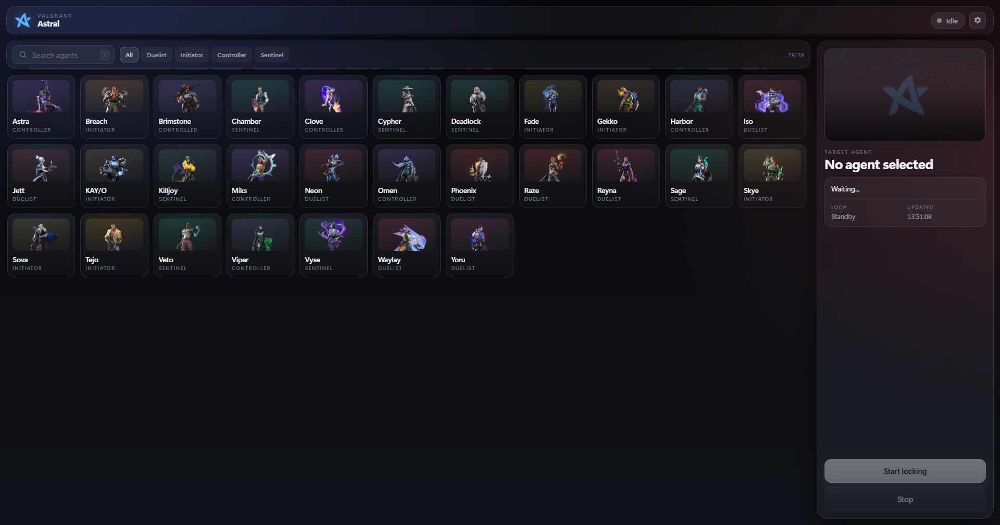
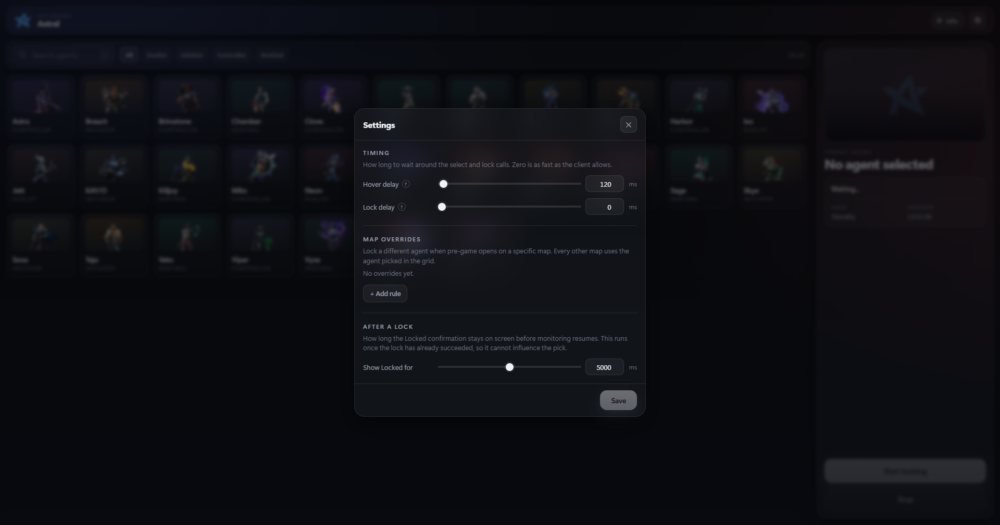

# Astral 🎯

Lock your Valorant agent before anyone else in the lobby finishes loading.


**[astral website →](https://crzx1337.github.io/Astral-ValoTool/)** · [download Astral.exe](https://github.com/CRZX1337/Astral-ValoTool/releases/latest)

---

## 🎉 What it does

A toolkit for your own Valorant client. Everything runs against the local client API — no credentials, no account login, nothing but the tokens the game already holds.

It's one C# app: an embedded ASP.NET Core Web API behind a native WebView2 window. Use the dark-mode desktop UI, or skip it entirely and talk to the local REST endpoints from your own scripts.

---

## 🧰 The tools

| Tool | What it does |
|---|---|
| **Instalock** | Detects pre-game and locks your agent, with per-map overrides and adjustable timing |
| **Rank tracker** | Current rank and RR, session wins/losses and net RR, and per-match RR deltas |
| **Auto-queue** | Requeues after a match and picks the queue |
| **Lobby intel** | Your own team's agent picks and ranks during agent select |
| **Phone companion** | A read-only mirror of rank, session and match history on your phone, on the same Wi-Fi |
| **Auto-updater** | Watches this repo's releases and installs a new build on request |

---

## ✨ Features

- ⚡ Detects the pre-game lobby and locks your agent through `RadiantConnect`.
- 🗺️ Per-map overrides, so you can have Sova on Ascent, Viper on Breeze, Omen on Lotus, and your main everywhere else.
- ⏱️ Hover, lock, and post-lock delays in milliseconds if you want the pick to look less instant.
- 📊 Rank and session tracking that refreshes on demand rather than polling Riot on a timer.
- 🔁 Auto-queue with real guard rails: it will not queue during a match, and it stops itself after a configurable number of requeues in a row.
- 👥 Lobby intel: while you're in agent select, see who else is on your team, what rank they are, and whether each pick is hovered or locked. It reads the pre-game payload your own client already received — nothing is looked up against another account, and anyone playing incognito stays unnamed.
- 🔄 Auto-updater: a banner appears when this repo publishes a newer release. Downloading it takes a click, installing it takes another — nothing is fetched or replaced behind your back. "Skip" silences one version without opting out of the next.
- 📡 Server-Sent Events on `/api/events`, one stream carrying every tool's state.
- 📱 A phone companion page on your LAN: open the panel in the desktop UI, scan the QR code, and the phone shows rank, session totals, recent matches, maps and agents — read-only, off by default.
- 🔔 Closing the window sends Astral to the system tray. Running loops keep going.
- 🖼️ Agent portraits, role icons and rank badges are fetched from `valorant-api.com` at runtime.
- 📦 The whole web frontend is embedded in the binary.

---

## 📸 Screenshots

### Main interface


### Settings and map overrides


---

## 🏗️ Tech stack

- C# 13 on .NET 10.0 (`net10.0-windows`)
- ASP.NET Core Web API, WinForms, and WebView2 in one process
- [RadiantConnect](https://github.com/RadiantConnect) v10.6.1 for the Valorant client interface
- Plain HTML5, CSS, and JavaScript, served from the embedded `wwwroot`
- Settings live in `%APPDATA%\Astral\settings.json`, with `appsettings.json` as the fallback
- Nothing gets written next to the executable. The embedded browser keeps its profile in `%LOCALAPPDATA%\Astral\WebView2`

---

## 📦 Installation

### You'll need

- Windows 10 or 11
- [.NET 10.0 SDK](https://dotnet.microsoft.com/download/dotnet/10.0), if you're building from source
- [Microsoft Edge WebView2 Runtime](https://developer.microsoft.com/en-us/microsoft-edge/webview2/), which is already on most modern Windows installs
- Valorant running on the same machine

### Build from source

1. Clone it:
   ```powershell
   git clone https://github.com/CRZX1337/Astral-ValoTool.git
   cd Astral-ValoTool
   ```

2. Run it:
   ```powershell
   dotnet run -c Release
   ```

3. Or publish a standalone executable:
   ```powershell
   dotnet publish -p:PublishProfile=SingleFile
   ```
   This uses the profile in `Properties\PublishProfiles\`, which squeezes the runtime, the frontend
   and the WebView2 loader into a single self-contained `Astral.exe` (~62 MB) under
   `bin\Publish\SingleFile\`. That one file is everything you need to ship. The `.pdb` and
   `web.config` written next to it aren't required to run.

   A plain `dotnet publish -c Release -r win-x64 --self-contained` works too, but you end up with the
   runtime scattered across a folder of loose assemblies.

---

## 🚀 Usage

### Desktop

1. Start **Astral.exe**, either before or during a Valorant session.
2. Pick your main from the agent grid. Press `/` to jump straight to the search box.
3. Add per-map overrides if you swap agents depending on the map.
4. Hit **Start Locking**. Astral watches your local game client and fires when pre-game starts.
5. Close the window whenever you want. It minimizes to the notification tray and keeps going.

### Phone companion

The desktop UI's **"Open on phone"** card turns on LAN access for this session. It's off every time Astral starts — nothing is ever listening on your network without you asking.

1. Open the "Open on phone" panel from the home screen. Astral picks the address that works from your Wi-Fi and shows a QR code.
2. Scan it with your phone's camera (or open the printed URL in a browser). The URL carries a one-time token in `?k=`.
3. The phone shows your rank, today's session, recent matches, map and agent breakdowns. It's read-only — there's no way to change anything from it.

Notes:

- Phone and PC must be on the same network. Guest networks, AP isolation and VPNs can keep them apart.
- The token is generated fresh each launch, and LAN access turns itself off when Astral exits. If you need it on the desktop UI's own firewall, use **Add firewall rule** in the panel.
- The companion reads today's session via the same refresh the desktop uses. If the phone was opened before any matches existed, it picks up new ones on its own.

---

## 🔌 API

On startup, Astral binds Kestrel to a random loopback port. It's `127.0.0.1` only, so nothing on your
network can reach it. From there you can drive or watch the lock loop yourself:

The three state-changing routes reject requests carrying an `Origin` header from another site, so a
web page you happen to have open can't drive your lock loop. Scripts don't send that header, so
`curl`, PowerShell and the examples below are unaffected.

Turning on the phone companion widens the same Kestrel to your LAN addresses. Every `/api/*` route
is then gated by a per-launch token (`?k=…`, `X-Astral-Token`, or the `astral_pair` cookie), and the
route set is read-only. The lock, auto-queue and updater routes refuse non-loopback calls outright.

| Route | Purpose |
|---|---|
| `GET /api/agents` | Agent list from the local RadiantConnect enum |
| `GET /api/agent-assets` | The same list enriched with portraits, roles and colours |
| `GET /api/state` | Current lock state |
| `GET /api/state/stream` | The same state pushed on every change (SSE) |
| `GET /api/events` | Every tool's state pushed on every change, tagged by module (SSE) |
| `POST /api/lock` | Start monitoring, or re-aim a running loop at another chain |
| `POST /api/stop` | Stop monitoring |
| `GET /api/options` | Settings plus the list of maps they can refer to |
| `PATCH /api/options` | Partial settings update, validated and persisted |
| `GET /api/tracker` | Rank, session totals and recent competitive matches |
| `POST /api/tracker/refresh` | Re-read rank and match history from Riot |
| `POST /api/tracker/session/reset` | Re-anchor the session to now |
| `GET /api/autoqueue` | Auto-queue state, party state and eligible queues |
| `POST /api/autoqueue/start` · `/stop` | Run or stop the automation loop |
| `POST /api/autoqueue/queueing` | Enter or leave the queue right now |
| `GET`/`PATCH /api/autoqueue/options` | Auto-queue settings and the queue list |
| `GET /api/intel` | Current pre-game lobby snapshot |
| `POST /api/intel/watch` | Start or stop watching agent select |
| `POST /api/lan/enable` | `{"enabled": true|false}` — open or close the phone companion for this session |
| `GET /api/lan/status` | LAN state, addresses, token fingerprint and firewall state (the panel's source) |
| `POST /api/lan/firewall` | `{"allow": true|false}` — add/remove the private-network inbound rule |
| `GET /mobile.html` | The companion page itself (only meaningful on the LAN, with `?k=`) |

#### Start, or switch the fallback chain
```http
POST /api/lock
Content-Type: application/json

{
  "agents": ["Jett", "Raze", "Neon"]
}
```

Agents are tried in order: the first one still free when pre-game opens is the
one that gets locked. Each attempt is confirmed against what pre-game reports
back, so a candidate somebody else already took falls through to the next
instead of being reported as a lock.

The original single-agent body still works and means a chain of one:
```http
POST /api/lock
Content-Type: application/json

{
  "agent": "Jett"
}
```

#### Stop
```http
POST /api/stop
```

#### Current state
```http
GET /api/state
```

You get back:
```json
{
  "isRunning": true,
  "isLocked": false,
  "selectedAgent": "Jett",
  "selectedAgents": ["Jett", "Raze", "Neon"],
  "status": "Waiting for pre-game. Falling back through 2 more.",
  "error": null,
  "updatedAt": "2026-07-29T15:44:03.7543142+00:00"
}
```

`isRunning` tells you the monitoring loop is active. `isLocked` is only true for the short window
after a successful lock, for as long as the *Show Locked for* setting holds it there.
`selectedAgents` is the whole chain; `selectedAgent` is its head while merely armed, and the agent
that was actually taken once `isLocked` is true — which is not necessarily the head, if a fallback
was used.

#### Live stream
```http
GET /api/state/stream
```
Sends `data: {...}` payloads on every state change, with `: ping` keepalive lines in between.

#### Settings and overrides
```http
PATCH /api/options
Content-Type: application/json

{
  "hoverDelayMs": 100,
  "lockDelayMs": 250,
  "postLockDelayMs": 5000,
  "mapAgentOverrides": {
    "Ascent": "Sova",
    "Haven": "Jett"
  }
}
```

#### Lobby intel

The watch holds a connection to your client, so it's opt-in rather than always on:
```http
POST /api/intel/watch
Content-Type: application/json

{
  "watching": true
}
```

While it's on, the roster is pushed over `/api/events` as it changes. `GET /api/intel`
returns the same snapshot on demand:
```json
{
  "isWatching": true,
  "isActive": true,
  "mapName": "Ascent",
  "players": [
    {
      "slot": 1,
      "isSelf": true,
      "isCaptain": true,
      "name": "You#EUW",
      "isIncognito": false,
      "agentName": "Neon",
      "pickState": "Locked",
      "tier": 21,
      "tierName": "Diamond 1"
    }
  ],
  "lockedCount": 1,
  "secondsRemaining": 41.3,
  "status": "Agent select on Ascent. 1 of 5 locked.",
  "error": null,
  "updatedAt": "2026-08-08T15:44:03.7543142+00:00"
}
```

`isActive` separates "there is no pre-game right now" from "we couldn't read it",
which is what `error` is for. `pickState` is `None`, `Hovering` or `Locked`.
Players with `isIncognito` come back with a null `name` — Astral doesn't resolve
names for people who asked not to be named.

#### Updater

Each step is its own call, because none of them should happen without asking:
```http
GET  /api/update           # last known state, no network call
POST /api/update/check     # ask GitHub what the newest release is
POST /api/update/download  # returns immediately; progress arrives on /api/events
POST /api/update/cancel    # abandon a download in flight
POST /api/update/apply     # replace the binary and restart into it
POST /api/update/skip      # {"version": "1.3.0"} — never offer this one again
```

`GET /api/update` returns:
```json
{
  "stage": "Available",
  "currentVersion": "1.2.0",
  "latestVersion": "1.3.0",
  "isUpdateAvailable": true,
  "releaseName": "Astral 1.3.0",
  "releaseNotes": "…",
  "releaseUrl": "https://github.com/CRZX1337/Astral-ValoTool/releases/tag/v1.3.0",
  "downloadSize": 62400000,
  "downloadedBytes": 0,
  "progress": null,
  "publishedAt": "2026-08-08T12:00:00+00:00",
  "isPrerelease": false,
  "status": "Version 1.3.0 is available.",
  "error": null,
  "checkedAt": "2026-08-08T12:04:11.221+00:00"
}
```

`stage` walks `Idle` → `Checking` → `UpToDate` | `Available` → `Downloading` →
`Ready` → `Restarting`, with `Failed` reachable from any of them and `error`
carrying the reason. `progress` is null until a download reports a total size.

`apply` renames the running executable to `<exe>.old`, copies the new one into
its place, launches it and closes this window; the leftover is swept on the next
start. If the copy fails the old binary is moved back, so a failed update never
leaves you without a working Astral. Releases that ship as an archive rather than
an `.exe` are downloaded but not installed — the banner says so.

---

## 🔧 Configuration

Whenever you change something in the UI or through the API, it's saved to
`%APPDATA%\Astral\settings.json`. The defaults come from `appsettings.json`:

```json
{
  "Instalocker": {
    "PostLockDelayMs": 5000,
    "HoverDelayMs": 0,
    "LockDelayMs": 0
  }
}
```

| Parameter | Type | Description |
|---|---|---|
| `HoverDelayMs` | integer | Wait before hovering/selecting the agent in pre-game. 0 to 10000 ms. |
| `LockDelayMs` | integer | Extra wait between hovering and clicking Lock. 0 to 10000 ms. |
| `PostLockDelayMs` | integer | Idle time after locking, before the state resets. 0 to 10000 ms. |
| `MapAgentOverrides` | object | Maps exact map names (`"Ascent"`, `"Breeze"`) to canonical agent names. Empty unless you add rules. |

`MapAgentOverrides` isn't in the shipped file. Add it yourself, or let the UI
write it to `%APPDATA%\Astral\settings.json`:

```json
{
  "Instalocker": {
    "MapAgentOverrides": {
      "Ascent": "Sova",
      "Breeze": "Viper"
    }
  }
}
```

### Updater

```json
{
  "Update": {
    "Repository": "CRZX1337/Astral-ValoTool",
    "CheckOnStartup": true,
    "IncludePrereleases": false
  }
}
```

| Parameter | Type | Description |
|---|---|---|
| `Repository` | string | `owner/repo` to watch. A blank value falls back to the default rather than failing every check. |
| `CheckOnStartup` | boolean | Check once, six seconds after launch. Turn it off and only manual checks run. |
| `IncludePrereleases` | boolean | Whether a prerelease counts as an update. Off by default. |
| `SkippedVersion` | string | Set by the banner's "Skip". That one version stays silent; later ones don't. |

The check is an unauthenticated call to the public releases API, so it's subject
to GitHub's rate limit for anonymous requests. Nothing is sent with it.

### Phone companion

```json
{
  "Lan": {
    "Enabled": false,
    "AllowFirewallRule": false
  }
}
```

| Parameter | Type | Description |
|---|---|---|
| `Enabled` | boolean | Whether the companion listens on your LAN addresses. Always starts false; the UI panel toggles it per session. |
| `AllowFirewallRule` | boolean | Whether the panel is allowed to add the inbound `Astral (LAN companion)` rule on private networks. The rule is removed again on exit. |

---

## 👥 Contributing

Bug reports and pull requests are welcome. If something's broken or you want a feature, open an issue
or send a PR.

1. Fork the repo
2. Branch off (`git checkout -b feature/cool-feature`)
3. Commit (`git commit -m 'Add cool feature'`)
4. Push (`git push origin feature/cool-feature`)
5. Open a pull request

---

## 📄 License

[MIT](LICENSE).

---

## 🙏 Credits and disclaimer

- Astral builds on [Askin242/Valorant-Instalocker-API](https://github.com/Askin242/Valorant-Instalocker-API) by [Sysy's](https://github.com/Askin242). The pre-game lock loop still comes from that C# implementation, which was originally inspired by [SuppliedOrange](https://github.com/SuppliedOrange).
- Local Valorant client communication runs through [RadiantConnect](https://github.com/RadiantConnect) ([project site](https://radiantconnect.ca/)).
- Agent assets and icons come from [Valorant-API](https://valorant-api.com/).
- Astral is not affiliated with, endorsed by, or sponsored by Riot Games, Inc. Valorant is a registered trademark of Riot Games, Inc. Use at your own discretion.
